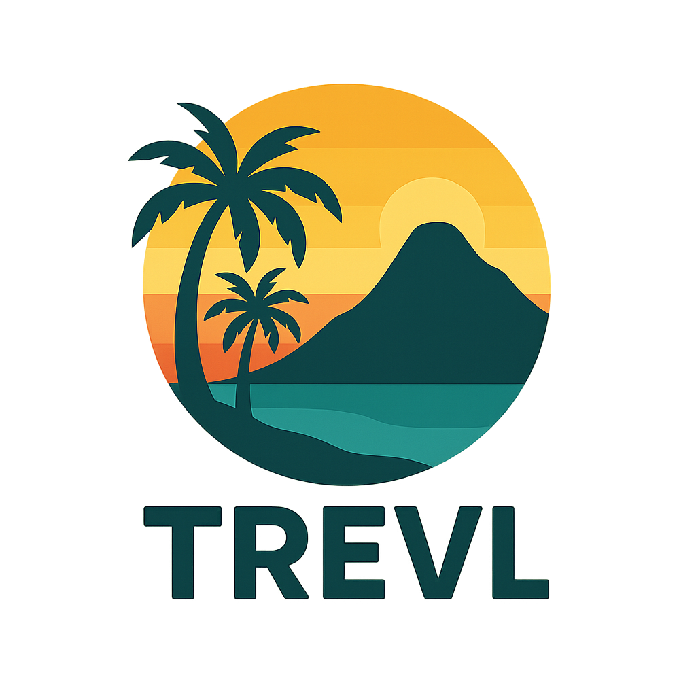

<p align="center">
  
</p>

<p align="center">
  
</p>

# 🌴 Trevl – Din digitale reisefotodagbok

Velkommen til **Trevl** – en moderne, flerspråklig fotoalbum-nettside laget med **Next.js**, **TypeScript** og **Tailwind CSS**.  
Her kan du samle, organisere og dele bilder og minner fra dine reiser på en enkel, stilig og responsiv måte.

---

## 🧭 Hva er dette prosjektet?

Trevl er laget for å være din personlige digitale reisefortelling.  
Den støtter flere språk, viser album for hvert reisemål og gir en estetisk, brukervennlig opplevelse.

---

## 🚀 Kom i gang

### 1. Klon prosjektet

```bash
git clone https://github.com/dittbrukernavn/trevl.git
cd trevl
```

### 2. Installer avhengigheter

```bash
npm install
```

### 3. Start utviklingsserveren

```bash
npm run dev
```

Åpne [http://localhost:3000](http://localhost:3000) i nettleseren din.

---

## 🛠️ Teknologier brukt

- **Next.js** – React-rammeverk med SSR og filbasert routing
- **TypeScript** – Statisk typet JavaScript
- **Tailwind CSS** – Utility-first stilark
- **React Context API** – For språk- og datahåndtering
- **JSON-basert oversettelse** – Enkel i18n-struktur

---

## 🗂️ Prosjektstruktur

```
trevl/
├── app/                     # Sider og routing
├── components/              # UI- og layoutkomponenter
├── public/                   # Bilder og statiske filer
│   ├── images/               # Reisebilder og logoer
│   └── data/captions/        # Bildetekstfiler (per språk)
├── styles/                   # Globale stilark
├── package.json              # Scripts og avhengigheter
└── tailwind.config.js        # Tailwind-konfigurasjon
```

---

## 📸 Eksempel på nettsiden

<p align="center">
  
</p>

---

## ✨ Hva inneholder siden?

- 🌍 Flerspråklig støtte (Norsk, Engelsk, Spansk – flere kommer)
- 🖼 Album per destinasjon
- 📄 Bildetekster via JSON-filer
- 📱 Responsivt design
- ⚡ Lynrask navigasjon med Next.js
- 🎨 Tilpassede logoer og tema

---

## 🔧 Videre utvikling

Planer for fremtiden:
- 🗺 Interaktivt kart over reisemål
- 🔍 Søkefunksjon
- 🎵 Mulighet for musikk/lydspor
- 🖊 Adminpanel for opplasting

---

## ✍️ Signatur

```
//  One bug to find them,
//  One fix to bring them all,
//  And in the darkness bind them.
```

---

## 📬 Kontakt

Send meg gjerne en melding hvis du ønsker å samarbeide eller gi tilbakemelding!
